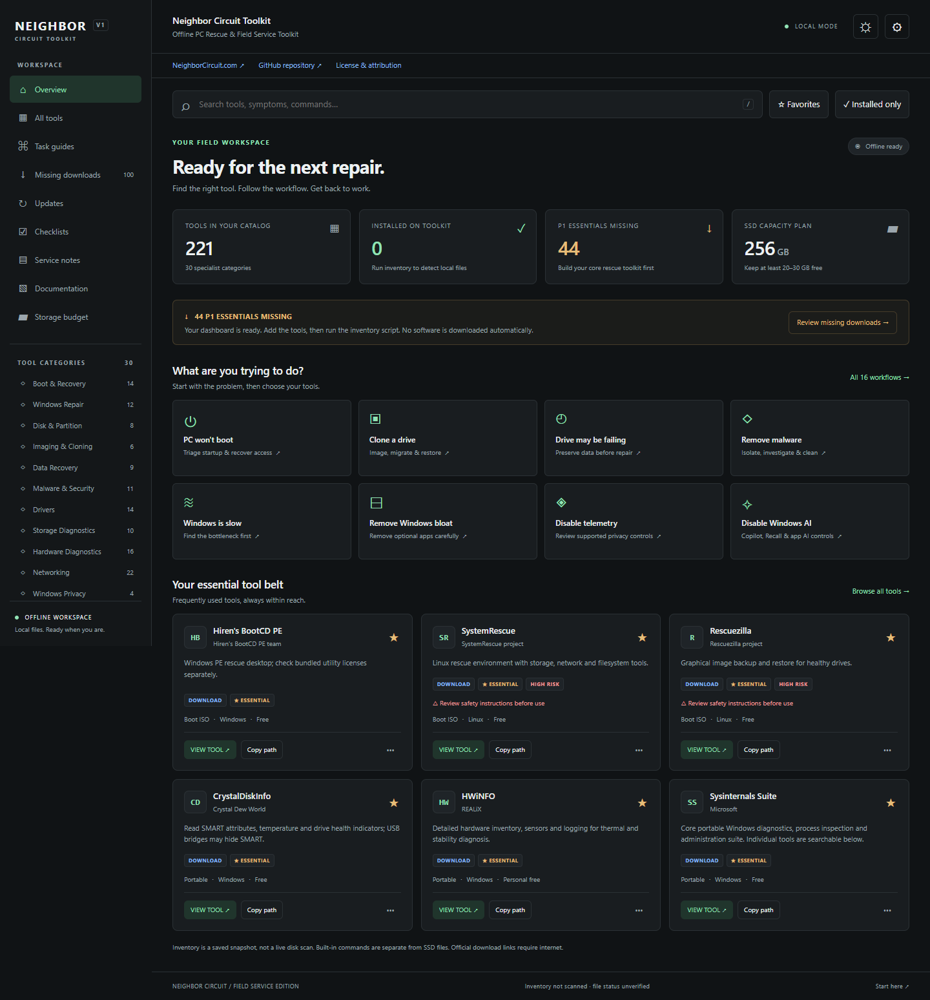

# Neighbor Circuit Toolkit

An offline PC rescue and field-service dashboard. Search tools, work through a repair, and keep the right commands and references close at hand.

**[Try the demo](https://samirank.github.io/neighbor-circuit-toolkit/)** · **[Download the offline ZIP](https://samirank.github.io/neighbor-circuit-toolkit/NEIGHBOR-CIRCUIT-TOOLKIT.zip)** · **[Setup and maintenance guide](NEIGHBOR-CIRCUIT-TOOLKIT/README.txt)**



## What is included

- 221 catalog records: software, built-in commands, driver and firmware libraries, and supplied scripts/references.
- 16 task guides, 10 saved checklists, and 24 offline reference sections.
- Instant search by symptom, category, vendor, platform, tag, and command.
- Favorites; installed, bootable, portable, priority, type, and update filters.
- Dark/light themes and card, list, and compact views.
- Local service notes with text/JSON export and workspace backup/import.
- Inventory generation, optional official-source metadata checks, and a preview-first download helper.
- Explicit licensing, freshness, and destructive-operation warnings.

The dashboard is plain HTML, CSS, and JavaScript. **No server, Node.js, Python, database, CDN, or internet connection is needed to browse the downloaded toolkit.** Software payloads, boot images, drivers, and commercial licenses are not included.

## Quick start

1. Download and extract `NEIGHBOR-CIRCUIT-TOOLKIT.zip`.
2. Open the top-level `index.html`. It opens the dashboard inside `NEIGHBOR-CIRCUIT-TOOLKIT`.
3. Use **Missing downloads** to obtain selected tools from their official sources.
4. Save/extract each tool to the displayed destination. Keep portable packages' directory structures intact.
5. Run an inventory updater, then reload the dashboard.

You can move the whole folder to another drive or computer. The catalog retains relative paths; the interface resolves them to the **complete filesystem address** when opened locally:

| Host | Example displayed / copied destination |
| --- | --- |
| Windows | `E:\NEIGHBOR-CIRCUIT-TOOLKIT\20_PORTABLE_APPS\Misc\CrystalDiskInfo` |
| Linux | `/media/sam/TOOLKIT/NEIGHBOR-CIRCUIT-TOOLKIT/20_PORTABLE_APPS/Misc/CrystalDiskInfo` |
| macOS | `/Volumes/TOOLKIT/NEIGHBOR-CIRCUIT-TOOLKIT/20_PORTABLE_APPS/Misc/CrystalDiskInfo` |

These are examples; the app uses the actual path from its local file URL, including nested folders, spaces, drive letters, and mount points. Windows network-share URLs resolve to UNC paths. A browser cannot infer a friendly volume label beyond what appears in its URL.

The **hosted demo cannot see your drives or launch local programs**. It labels destinations as templates and disables local-folder access. Download the project and open it locally for actual paths. Browser policy can still restrict opening executables; use **Copy path** with your operating system's file manager. The dashboard never executes programs automatically.

## Clean layout

```text
neighbor-circuit-toolkit/
├── index.html                     # Entry point
├── README.md
├── NEIGHBOR-CIRCUIT-TOOLKIT.zip     # Ready-to-use download
└── NEIGHBOR-CIRCUIT-TOOLKIT/
    ├── index.html                 # Actual dashboard
    ├── assets/                    # Local styles, data and application
    ├── 00_BOOT/
    ├── 10_WINDOWS_TOOLBOX/
    ├── 20_PORTABLE_APPS/
    ├── 30_DRIVERS/
    ├── 40_INSTALLERS/
    ├── 50_FIRMWARE/
    ├── 60_SCRIPTS/
    ├── 70_DOCUMENTATION/
    ├── 80_LICENSED_TOOLS/
    └── 90_TEMP/
```

Repository automation and tests live in `.github/`. Local development backups and test reports are ignored. The offline ZIP excludes repository automation and development files.

## Windows, Linux, and macOS

The **dashboard** works in modern desktop browsers on these systems. It has no OS-specific browser dependency. Individual catalog tools and commands retain their actual OS requirements: a Windows executable is not made Linux-compatible by the dashboard. Mobile file browsing depends on the browser and OS; a desktop is recommended for field work.

Run maintenance from inside `NEIGHBOR-CIRCUIT-TOOLKIT`:

**Windows PowerShell 5.1 or PowerShell 7 on Windows**

```powershell
.\60_SCRIPTS\Inventory\Update-ToolkitInventory.ps1
```

**Linux / macOS, or Windows with Python 3.9+**

```sh
python3 60_SCRIPTS/Inventory/update_toolkit_inventory.py
```

Use `--what-if` with Python or `-WhatIf` with PowerShell for a scan without writing. Python is optional maintenance tooling, not a dashboard runtime dependency. The cross-platform updater never runs binaries; executable versions remain unknown. The Windows updater can read version resources without launching programs.

Both write `assets/js/local-inventory.js`. A scan records expected-file presence, size, and modification time. It does not prove a complete installation, authenticity, licensing, hardware compatibility, or that a utility is installed on the host PC. The default demo is unscanned, and local snapshots are excluded from Git.

### Optional online maintenance (Windows)

```powershell
# Official publisher pages and supported GitHub release metadata only.
.\60_SCRIPTS\Inventory\Update-ToolkitMetadata.ps1

# Preview the small reviewed automatic-download subset.
.\60_SCRIPTS\Inventory\Download-MissingTools.ps1 -WhatIf
```

The download helper requires confirmation, skips existing files unless explicitly replacing, checks configured publisher SHA256 values, and never runs or extracts downloaded packages. Most downloads remain manual through official catalog links. Licensed tools always require your own authorized source and license.

## Using a Ventoy SSD

Neighbor Circuit Toolkit is independent of Ventoy and is not affiliated with or endorsed by the Ventoy project. Ventoy is an optional way to boot the rescue images cataloged here.

1. Back up the SSD before installing Ventoy; initial installation repartitions the selected drive.
2. Install Ventoy from its official project source and verify the target drive carefully.
3. Copy the extracted toolkit folder and root `index.html` to the **data partition**, not the small EFI partition.
4. Copy boot ISO files into `NEIGHBOR-CIRCUIT-TOOLKIT/00_BOOT/` and its categories. Do not flash those ISOs over the data partition.
5. Ventoy normally searches subdirectories; if you configured a search-root restriction, include this nested `00_BOOT` location.
6. Test your selected images on representative BIOS/UEFI hardware before a service visit.

You may also copy only the contents of `NEIGHBOR-CIRCUIT-TOOLKIT` to the data partition root. Both layouts work because paths resolve from the dashboard's actual location. Keep at least 20–30 GB free on a 256 GB drive and use separate healthy media for recovery output.

## Notes, privacy, and local state

Favorites, notes, preferences, and checklists live in this browser profile's `localStorage`. They do **not** automatically travel with the drive. Browser policies, private browsing, and file-URL changes can affect persistence. Use **Settings → Export workspace backup** before moving or switching browsers.

Never record customer passwords, BitLocker recovery keys, recovery codes, or other authentication secrets. Store approved service records privately and clear job data before handing over the device. The hosted demo also uses browser storage and does not submit notes to a server.

All account recovery guidance is **AUTHORIZED SYSTEMS ONLY**. No authentication or encryption bypass is provided. Review HIGH RISK warnings before disk writes, boot repair, firmware changes, aggressive app removal, or stress testing.

## Catalog and source notes

Edit `NEIGHBOR-CIRCUIT-TOOLKIT/assets/js/tools-data.js`, keeping its assigned array valid JSON. Then run `Export-ToolkitManifest.ps1` on Windows, or regenerate the JSON manifest with an equivalent JSON-only authoring step. Keep IDs stable so favorites and task guides continue to work.

Primary sources were reviewed during the September 2026 build. Source reachability is separate from current-version verification. Unknown versions remain unknown. Some sources reject automated checks; read the [source-review report](NEIGHBOR-CIRCUIT-TOOLKIT/70_DOCUMENTATION/source-review.html). Free personal use is not equivalent to a commercial/technician license. Tool vendors retain their respective names and licensing terms.

## GitHub Pages and development

GitHub Pages is configured through `.github/workflows/pages.yml`. In a fork, enable **Settings → Pages → Source: GitHub Actions**, update `assets/js/site-config.js` and the README links for your account, then push to `main`. The workflow publishes a clean copy and creates the downloadable ZIP; it does not publish local inventory or customer files.

```sh
node .github/tests/validate-paths.cjs
node .github/tests/validate-structure.cjs
python3 .github/tests/test_inventory.py

# Builds from tracked source only; stage new source files first.
python3 .github/scripts/build_distribution.py
```

Cross-platform CI runs on Windows, Linux, and macOS. Browser tests use Playwright as a **development-only** dependency; set `PLAYWRIGHT_PATH` and optionally `BROWSER_EXECUTABLE` for your environment. The shipped dashboard has no such dependency.

For contributions, describe the technician use case, use official sources, keep license and OS restrictions explicit, and avoid adding payloads or speculative “optimization” tweaks. Include relevant tests for paths, inventory, or behavior changes.

## License and attribution

Copyright © 2026 Samiran Kakoty. The toolkit uses the custom [Neighbor Circuit Toolkit Source-Available License](NEIGHBOR-CIRCUIT-TOOLKIT/LICENSE.txt). Personal and commercial use, modification, and redistribution are allowed, subject to retaining the product name, copyright notice, license, and visible attribution links. Rebranding or presenting it as your own product is not permitted. Modified versions must identify their changes and must not imply official endorsement.

This is source-available software, not an OSI-approved open-source release. Third-party tools retain their own licenses. See [NeighborCircuit.com](https://neighborcircuit.com/) for the project brand.
