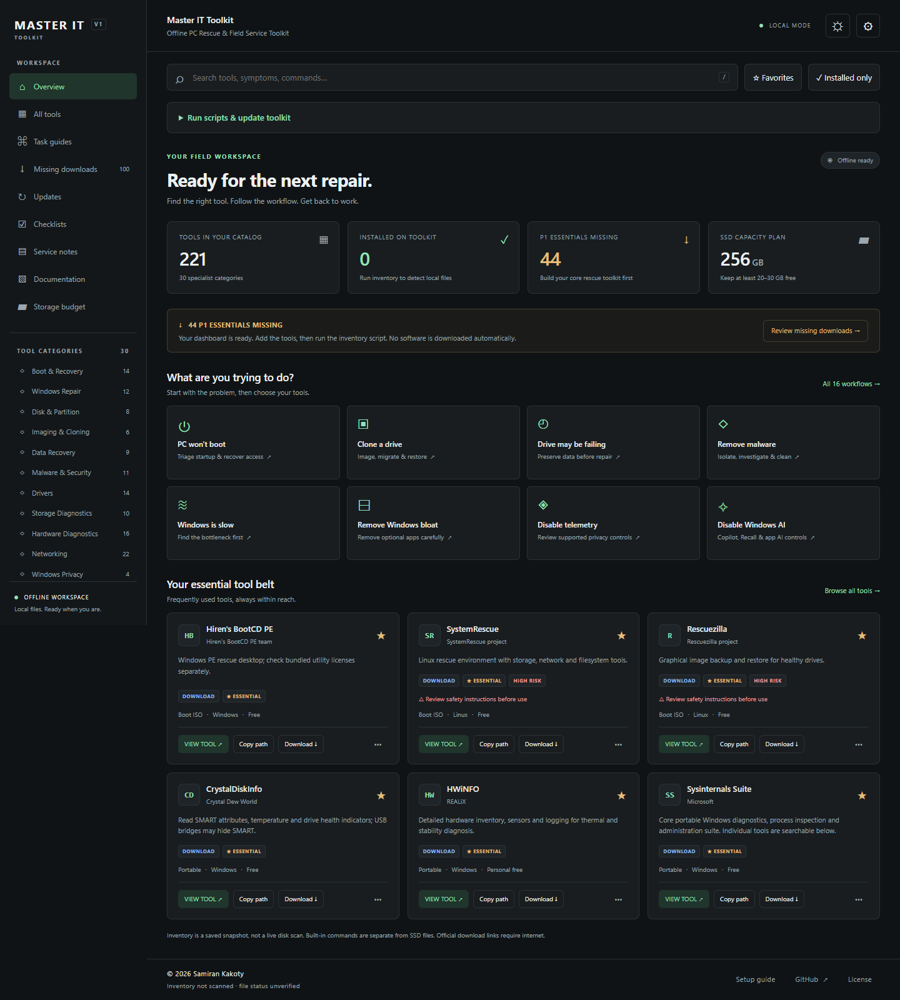

# Master IT Toolkit

An offline PC rescue and field-service dashboard. Search tools, work through a repair, and keep the right commands and references close at hand.

**[Try the demo](https://samirank.github.io/master-it-toolkit/)** · **[Download the offline ZIP](https://samirank.github.io/master-it-toolkit/MASTER-IT-TOOLKIT.zip)** · **[Setup and maintenance guide](MASTER-IT-TOOLKIT/README.txt)**



## What is included

- 275 catalog records: software, built-in commands, driver and firmware libraries, and supplied scripts/references.
- 16 task guides, 11 saved checklists, and 24 offline reference sections.
- Instant search by symptom, category, vendor, platform, tag, and command.
- Favorites; installed, bootable, portable, priority, type, and update filters.
- Dark/light themes and card, list, and compact views.
- Local service notes with text/JSON export and workspace backup/import.
- Inventory generation, optional official-source metadata checks, and a preview-first download helper.
- Explicit licensing, freshness, and destructive-operation warnings.

The dashboard is plain HTML, CSS, and JavaScript. **No server, Node.js, Python, database, CDN, or internet connection is needed to browse the downloaded toolkit.** Software payloads, boot images, drivers, and commercial licenses are not included.

## Quick start

1. Download and extract `MASTER-IT-TOOLKIT.zip`.
2. Open the top-level `index.html`. It opens the dashboard inside `MASTER-IT-TOOLKIT`.
3. Use **Missing downloads** to obtain selected tools from their official sources.
4. Save/extract each tool to the displayed destination. Keep portable packages' directory structures intact.
5. Run an inventory updater, then reload the dashboard.

You can move the whole folder to another drive or computer. The catalog retains relative paths; the interface resolves them to the **complete filesystem address** when opened locally:

| Host | Example displayed / copied destination |
| --- | --- |
| Windows | `E:\MASTER-IT-TOOLKIT\20_PORTABLE_APPS\Misc\CrystalDiskInfo` |
| Linux | `/media/sam/TOOLKIT/MASTER-IT-TOOLKIT/20_PORTABLE_APPS/Misc/CrystalDiskInfo` |
| macOS | `/Volumes/TOOLKIT/MASTER-IT-TOOLKIT/20_PORTABLE_APPS/Misc/CrystalDiskInfo` |

These are examples; the app uses the actual path from its local file URL, including nested folders, spaces, drive letters, and mount points. Windows network-share URLs resolve to UNC paths. A browser cannot infer a friendly volume label beyond what appears in its URL.

The **hosted demo cannot see your drives or launch local programs**. It labels destinations as templates and disables local-folder access. Download the project and open it locally for actual paths. Browser policy can still restrict opening executables; use **Copy path** with your operating system's file manager. The static dashboard cannot execute programs. The optional local Windows launcher supports explicit portable launches and reviewed workflows.

## Clean layout

```text
master-it-toolkit/
├── index.html                     # Entry point
├── README.md
├── MASTER-IT-TOOLKIT.zip     # Ready-to-use download
└── MASTER-IT-TOOLKIT/
    ├── index.html                 # Actual dashboard
    ├── assets/                    # Local styles, data and application
    ├── 00_BOOT/
    ├── 10_WINDOWS_TOOLBOX/
    ├── 20_PORTABLE_APPS/
    ├── 30_DRIVERS/
    ├── 40_INSTALLERS/
    ├── 50_FIRMWARE/
    ├── 60_SCRIPTS/
    ├── 70_DOCUMENTATION/
    ├── 80_LICENSED_TOOLS/
    └── 90_TEMP/
```

Repository automation and tests live in `.github/`. Local development backups and test reports are ignored. The offline ZIP excludes repository automation and development files.

## Windows, Linux, and macOS

The **dashboard** works in modern desktop browsers on these systems. It has no OS-specific browser dependency. Individual catalog tools and commands retain their actual OS requirements: a Windows executable is not made Linux-compatible by the dashboard. Mobile file browsing depends on the browser and OS; a desktop is recommended for field work.

Run maintenance from inside `MASTER-IT-TOOLKIT`:

**Windows PowerShell 5.1 or PowerShell 7 on Windows**

```powershell
.\60_SCRIPTS\Inventory\Update-ToolkitInventory.ps1
```

**Linux / macOS, or Windows with Python 3.9+**

```sh
python3 60_SCRIPTS/Inventory/update_toolkit_inventory.py
```

Use `--what-if` with Python or `-WhatIf` with PowerShell for a scan without writing. Python is optional maintenance tooling, not a dashboard runtime dependency. The cross-platform updater never runs binaries; executable versions remain unknown. The Windows updater can read version resources without launching programs.

Both write `assets/js/local-inventory.js`. A scan records expected-file presence, size, and modification time. It does not prove a complete installation, authenticity, licensing, hardware compatibility, or that a utility is installed on the host PC. The default demo is unscanned, and local snapshots are excluded from Git.

### Optional online maintenance (Windows)

```powershell
# Official publisher pages and supported GitHub release metadata only.
.\60_SCRIPTS\Inventory\Update-ToolkitMetadata.ps1

# Preview the small reviewed automatic-download subset.
.\60_SCRIPTS\Inventory\Download-MissingTools.ps1 -WhatIf
```

The download helper requires confirmation, skips existing files unless explicitly replacing, checks configured publisher SHA256 values, and never runs or extracts downloaded packages. Most downloads remain manual through official catalog links. Licensed tools always require your own authorized source and license.

## Using a Ventoy SSD

Master IT Toolkit is independent of Ventoy and is not affiliated with or endorsed by the Ventoy project. Ventoy is an optional way to boot the rescue images cataloged here.

1. Back up the SSD before installing Ventoy; initial installation repartitions the selected drive.
2. Install Ventoy from its official project source and verify the target drive carefully.
3. Copy the extracted toolkit folder and root `index.html` to the **data partition**, not the small EFI partition.
4. Copy boot ISO files into `MASTER-IT-TOOLKIT/00_BOOT/` and its categories. Do not flash those ISOs over the data partition.
5. Ventoy normally searches subdirectories; if you configured a search-root restriction, include this nested `00_BOOT` location.
6. Test your selected images on representative BIOS/UEFI hardware before a service visit.

You may also copy only the contents of `MASTER-IT-TOOLKIT` to the data partition root. Both layouts work because paths resolve from the dashboard's actual location. Keep at least 20–30 GB free on a 256 GB drive and use separate healthy media for recovery output.

## Notes, privacy, and local state

Favorites, notes, preferences, and checklists live in this browser profile's `localStorage`. They do **not** automatically travel with the drive. Browser policies, private browsing, and file-URL changes can affect persistence. Use **Settings → Export workspace backup** before moving or switching browsers.

Never record customer passwords, BitLocker recovery keys, recovery codes, or other authentication secrets. Store approved service records privately and clear job data before handing over the device. The hosted demo also uses browser storage and does not submit notes to a server.

All account recovery guidance is **AUTHORIZED SYSTEMS ONLY**. No authentication or encryption bypass is provided. Review HIGH RISK warnings before disk writes, boot repair, firmware changes, aggressive app removal, or stress testing.

## Catalog and source notes

Edit `MASTER-IT-TOOLKIT/assets/js/tools-data.js`, keeping its assigned array valid JSON. Then run `Export-ToolkitManifest.ps1` on Windows, or regenerate the JSON manifest with an equivalent JSON-only authoring step. Keep IDs stable so favorites and task guides continue to work.

Primary sources were reviewed during the September 2026 build. Source reachability is separate from current-version verification. Unknown versions remain unknown. Some sources reject automated checks; read the [source-review report](MASTER-IT-TOOLKIT/70_DOCUMENTATION/source-review.html). Free personal use is not equivalent to a commercial/technician license. Tool vendors retain their respective names and licensing terms.

## GitHub Pages and development

GitHub Pages is configured through `.github/workflows/pages.yml`. In a fork, enable **Settings → Pages → Source: GitHub Actions**, update `assets/js/site-config.js` and the README links for your account, then push to `main`. The workflow publishes a clean copy and creates the downloadable ZIP; it does not publish local inventory or customer files.

```sh
node .github/tests/validate-paths.cjs
node .github/tests/validate-structure.cjs
python3 .github/tests/test_inventory.py

# Builds from tracked source only; stage new source files first.
python3 .github/scripts/build_distribution.py
```

Cross-platform CI runs on Windows, Linux, and macOS. Browser tests use Playwright as a **development-only** dependency; set `PLAYWRIGHT_PATH` and optionally `BROWSER_EXECUTABLE` for your environment. The shipped dashboard has no such dependency.

For contributions, describe the technician use case, use official sources, keep license and OS restrictions explicit, and avoid adding payloads or speculative “optimization” tweaks. Include relevant tests for paths, inventory, or behavior changes.

## Optional standalone launcher

Download a package from [GitHub Releases](https://github.com/samirank/master-it-toolkit/releases/latest), extract the entire ZIP, and open the root `Master-IT-Toolkit.exe` on Windows. Linux x64 and macOS Apple Silicon packages contain `Start-Master-IT-Toolkit` instead. These packages include the runtime; Python does not need to be installed. The unsigned builds may require approval under your operating system's application policy.

The launcher opens your browser at a private loopback address. Keep its terminal open and use **Run scripts & update toolkit**. Close script terminals when finished; only one action runs at a time. Windows repair requires an administrator launcher, and the PowerShell scripts retain their own confirmation prompts and organization-policy requirements. The launcher uses a process-only PowerShell execution-policy bypass for these explicitly selected bundled scripts; it does not change the machine or user execution policy. Linux and macOS support the inventory scan and toolkit updater; Windows scripts require Windows.

The source ZIP remains usable without the launcher. For launcher mode from source, install Python 3.9+ and open `Start-Toolkit.cmd`, or run `python3 launcher.py` from the toolkit folder on Linux/macOS. If port 8765 is occupied, close the existing launcher first. Browser storage is separate from direct-file mode; export and import your workspace backup when switching modes.

**Update toolkit from GitHub** downloads the committed distribution ZIP from a fixed commit in `samirank/master-it-toolkit`. It checks distribution hashes, backs up replaced files in `.toolkit-backups`, and stops when managed files have local edits. Downloaded utilities, local inventory, and service notes are excluded. It updates toolkit code, scripts and documentation, not vendor applications or the embedded Python runtime. Restart the launcher after an update. A newer standalone runtime, when needed, comes from a new release package.

For a manual rollback, close the launcher, copy files from the timestamped backup back to matching toolkit paths, and consult its `changes.json`: entries marked `false` were newly added and can be removed. Back up your workspace before restoring. Updates require internet; ordinary launcher use and inventory scanning work offline.

## License and attribution

Copyright © 2026 Samiran Kakoty. The toolkit uses the custom [Master IT Toolkit Source-Available License](MASTER-IT-TOOLKIT/LICENSE.txt). Personal and commercial use, modification, and redistribution are allowed, subject to retaining the product name, copyright notice, license, and visible attribution links. Rebranding or presenting it as your own product is not permitted. Modified versions must identify their changes and must not imply official endorsement.

This is source-available software, not an OSI-approved open-source release. Third-party tools retain their own licenses.

### Per-tool downloads

Click **Download** on a tool card or Missing downloads row. In launcher mode, supported publisher GitHub releases (including 7-Zip) show platform and filename choices: select one, a platform, all platforms, or any combination, then **Download selected to SSD**. Files go to that tool's folder. Existing files are kept; partial downloads are cleaned up, and GitHub SHA256 digests are checked when provided. Packages are never executed or extracted automatically. Publishers with license, sign-in, or custom download flows retain an official download link. The hosted demo offers browser downloads; it cannot write directly to your SSD.

Standalone ZIPs contain the executable at the root beside `MASTER-IT-TOOLKIT/`; root HTML and README files are omitted. Keep that folder beside the executable. Existing nested launchers remain supported, but download a new standalone package to get the root executable layout.

### Download detection and quick scans

The default inventory scan indexes each relevant directory once and reuses file metadata. Full folder sizing is optional: run `python3 60_SCRIPTS/Inventory/update_toolkit_inventory.py --full-storage`. Downloaded installers/archives and ready-to-run files are tracked separately. Save vendor downloads into the copyable directory shown in the download popup. Files saved in your browser Downloads directory are not scanned.

Launcher downloads save version receipts and automatically refresh inventory. **Check downloaded tool updates** compares supported publisher releases without downloading them. Tool cards show **Downloaded** for existing files and **Update** only when a newer known version is available; unknown versions remain unknown. The catalog now includes the EaseUS product families and platform variants listed in its product/download centers (license editions are grouped), plus video editors, recording, notes, email and remote-support applications. Every tool detail includes an offline quick start and an official documentation link.

### Automatic ZIP organization

Local launcher scans extract recognized ZIP downloads into `Ready/<archive-name>-<fingerprint>/` beside the original download, then refresh availability. Original archives remain as backups. Existing files are never overwritten. Temporary extraction files are cleaned after success or failure, and unchanged archives are skipped on later scans. First extraction takes longer than an inventory-only scan.

Only catalog-recognized packages inside toolkit folders are eligible. Unrelated files are left alone. Paths, links, duplicate names, CRC checks, free space and extraction limits are checked. Encrypted ZIPs, archives over 8 GiB expanded or 50,000 entries, and non-ZIP formats require manual extraction. EXE/MSI installers are never run automatically. ZIPs containing installers still require installation. The hosted demo cannot organize local files.

Run `python 60_SCRIPTS/Inventory/update_toolkit_inventory.py --no-organize` from the toolkit folder for inventory only; `--what-if` also leaves files untouched. Organization works through the Python/frozen scanner on Windows, Linux and macOS. The legacy PowerShell-only fallback scans without extraction.

Download manager and app window

The launcher opens a dedicated Edge/Chrome/Chromium app window without browser tabs when a supported browser is installed (otherwise it falls back to the default browser). This is a portable launcher with an app window, not an installed PWA: keep its local launcher running for scripts, downloads and SSD access. No browser installation or system settings are changed.

Download dialogs display received/total bytes, a progress bar (indeterminate when the publisher omits the size), selected-file counts, saved paths and scan results. Downloaded tools have a Manage files button. Vendor links open a separate popup; save into the shown folder or use Import downloaded file to copy a package from another folder. While the manager is open, stable changes in the destination trigger a local scan and refresh the dashboard. Browser-managed transfers expose their detailed progress in the publisher window/browser download panel; the toolkit cannot read arbitrary third-party download events. Refresh files & scan is available if automatic detection does not apply. Imports preserve existing files and automatically scan/organize afterward. Closing a dialog does not cancel an active launcher transfer.

Background activity shows a persistent loader, current task and elapsed time during scans, downloads, bulk downloads, imports and updates. It remains visible with the launcher panel collapsed. Measured transfers show progress bars; other tasks use an indeterminate loader. Completion and errors remain visible until dismissed. For terminal-based scripts, the launcher stays busy until the terminal is closed. Reduced-motion preferences are respected.

Tracked application installation

Install on this PC opens a review, never starts an installer immediately. Through the Windows launcher, recognized EXE/MSI installers can run interactively after UAC, an installer/hash check, a before-program snapshot, and creation/verification of a new System Restore checkpoint. Unsigned packages without explicit official-source confirmation, invalid signatures, unavailable System Protection, restore-point frequency limits, or changed files stop the operation before installation. No policy settings or restore-point limits are bypassed. Choose the correct architecture and review installer choices. Firmware, drivers and boot media require their own procedures; portable tools usually need no install. Linux/macOS use their platform installer or package manager.

Install records are stored per computer in 70_DOCUMENTATION/Service-Notes/Install-History and preserved by toolkit updates. They include program lists, installer hash/publisher, return code and checkpoint identity; MSI installs also have a verbose log. These local records are excluded from published packages. A successful process exit is labeled review required, not proof of installation. Programs and Features and System Restore buttons open native interfaces for deliberate recovery. A restore point is not a disk image or a guaranteed complete rollback; keep a verified backup for changes that must be fully reversible.

Revo Uninstaller Pro is suggested for its own traced-install workflow. BCUninstaller is a free/open-source uninstall manager. Neither is installed automatically, and toolkit installs do not claim Revo tracing. For monitored installation, follow Revo's Install Program or installer context-menu workflow after preparing your recovery plan.

Sources: https://www.revouninstaller.com/online-manual/uninstaller/ ; https://www.bcuninstaller.com/ ; https://learn.microsoft.com/en-us/powershell/module/microsoft.powershell.management/checkpoint-computer?view=powershell-5.1 ; https://learn.microsoft.com/en-us/windows/win32/msi/rollback-installation

Unsigned installers require an explicit official-source confirmation in the review dialog. The approved hash and unsigned status are recorded; broken or invalid signatures remain blocked. This is a conscious exception, not publisher authentication.

Smart host and SSD inventory

The launcher starts a background scan automatically (use --no-startup-scan to opt out). Scans separately report registered applications on this computer, ready SSD files, downloaded installers, archives needing extraction, and interrupted files needing review. Host identity is checked so moving the SSD to another computer does not reuse that computer's installed-program status. Install review also checks the host directly. An installed host app does not replace a downloaded SSD package; the Downloaded only filter still refers to SSD files. Use Availability for Installed on this PC, Not detected on this PC, Ready on SSD, Needs extraction, Needs attention, and Missing on PC and SSD. A newer recognized SSD package gets an Update on this PC action.

Windows detection reads current-user and machine uninstall registry entries in 32/64-bit views without launching applications or invoking Win32_Product. Linux reads dpkg/rpm package databases; macOS reads application bundle metadata in standard Applications folders. Detection is conservative: exact normalized names and curated aliases/package IDs are used. Store-only apps, unsupported package managers, unregistered portable apps and uncommon installation locations can be missed; Not detected is not proof of absence. The detail view shows the evidence, version and coverage.

Recognized ZIP archives are extracted once. Other archive formats are identified for manual extraction. Installer executables are not confused with portable executables. Partially downloaded files and toolkit extraction staging folders older than 24 hours are listed for cleanup review, including their paths. Original downloads and installation/recovery records are preserved; review candidates are not automatically deleted.

## Portable tools and workflows

In the Windows launcher, **Run portable** opens a recognized, scanned portable EXE with one click. If multiple executables are present, choose the intended file. Installers, archives, boot images and arbitrary command lines are excluded. Download the portable edition and scan first. Tools requiring administrator access must be opened explicitly as administrator; the runner does not elevate automatically.

Checklists and task guides now have **Start workflow** controls and launch buttons on supported steps. Choose **Manual launches** or **Automatic launches**. Automatic mode launches the available tool for the next supported step; every step pauses for technician verification before advancing. This is supervised automation: malware detections, consent, destructive operations and migration settings are never approved by a process exit code. Helper processes may outlive their parent; review all tool windows and results before continuing.

The runner records verified and skipped steps separately. **Stop workflow** prevents further launches and leaves open applications running. Closing the panel does not stop the runner; reopen **Workflow status** to continue. Export the workflow record before restarting the launcher or starting another workflow. Records are session-only and do not silently check off the browser's saved checklist. Other toolkit jobs wait until the workflow is stopped or finished; stop it first if a missing package needs downloading.

**Data Migration** and **New PC / profile migration** cover source health, independent backups, fully downloaded cloud files, approved folder selection, a reviewed Robocopy/rsync copy and log, copy-log review, sample-file checks and owner acceptance. Preview source and destination paths; avoid Move or deletion/mirroring. Application installation and supported profile imports are separate from copying data; copying Windows or Program Files is not an OS migration. Originals remain until acceptance.

Portable process launching currently supports Windows EXEs. Linux/macOS still provide the dashboard, inventory and guided checklist content; use native tools there. The hosted demo previews workflows but cannot run programs. A bootable toolkit ISO is a future roadmap item, not part of this release.


SOFTWARE SELECTION POLICY
Prefer suitable free and open-source software, then no-cost tools included with
the operating system or available as freeware. Keep freemium, personal-only,
trial and paid products as alternatives for a specific required capability.
Commercial-use and redistribution terms still apply; free does not mean open source.

The default catalog and task recommendations now use this order. The Automation-friendly
sort favors documented batch/command-line support within each licensing tier.
A BATCH / CLI AVAILABLE badge describes the vendor capability, not a promise
that the toolkit can already operate every feature unattended. Prefer explicit
inputs, logs, documented return codes, preview and recovery options over GUI clicking.
BCUninstaller is the first uninstall-manager suggestion; Revo Pro tracing is optional.

Migration preference: Robocopy on Windows and rsync on Linux/macOS, with reviewed
paths, a preview, logs and independent verification. FastCopy remains an optional
GUI alternative. The copy step is currently a manual checkpoint: this release
does not introduce a configured, unattended Robocopy/rsync copy adapter. No files
are copied until the technician explicitly configures and starts the chosen tool.


COMPACT REPORTS AND BUNDLED BROWSER
The launcher controls start collapsed. Status and popup notifications show a short
summary; expand Full report or open Logs / Job history to read complete output.
Local SQLite history retains the latest 500 jobs (the dialog shows 100), under
70_DOCUMENTATION/Service-Notes/Activity/activity.sqlite. It is excluded from
releases, static serving and toolkit updates. Back up private service notes separately.
Existing installation records remain available through installation history.

New standalone packages include their own browser engine and driver. Publisher
windows use isolated temporary profiles and route downloaded software into the
selected catalog folder, followed by a scan/organization callback. Existing filenames
are preserved; unsupported files and transfers attempted during another active job
are rejected and logged. Downloads are staged in 90_TEMP/browser-sessions, never
in the user's normal Downloads folder, and are never automatically executed.
Closing a publisher window can cancel its transfers. Some vendors may refuse
embedded/automated browsers; use a direct publisher package or explicit file import.

Dashboard browser data persists in the private Service-Notes/BrowserProfile folder.
When moving from your old browser, export its workspace backup and import it into
the bundled app if you need its notes/favorites. Publisher cookies are temporary.
Dashboard report exports go to Service-Notes/Exports. Browser software has its own
third-party notices in runtime-licenses, including the bundled browser credits.

Upgrade the COMPLETE standalone package to obtain new browser/runtime versions;
the source-only GitHub updater does not replace the browser or launcher EXE.
Keep the executable beside MASTER-IT-TOOLKIT. Existing source-only installations
can still use direct downloads/import, but managed publisher windows require the
new runtime. Source developers: install playwright==1.62.0 in a virtual environment,
set PLAYWRIGHT_BROWSERS_PATH to the toolkit runtime-browser folder, then run
python -m playwright install chromium --no-shell (Linux also needs system browser dependencies).

SQLite is a history database, not an authentication or encryption boundary.
The existing random local session URL and same-origin request protection remain;
this version adds no technician accounts or password vault. It does not encrypt
files on the SSD. The bundled desktop window is not a browser-installed PWA.


AD BLOCKING AND DOWNLOAD COMPLETION
Publisher windows include unmodified uBlock Origin Lite 2026.907.2003 with its
bundled default filters. The Downloads dialog has a Block ads on publisher site
checkbox. After changing it, reload the publisher page. Exceptions last for the
launcher session. The offline dashboard does not load this extension.
Source and license: https://github.com/uBlockOrigin/uBOL-home/releases/tag/2026.907.2003
The original GPL-3.0 license is included at runtime-extensions/ubol/LICENSE.txt.
These third-party files are not governed by the toolkit's custom branding license.

Catalogued PowerShell downloads such as WinUtil are supported as files, never
automatically executed. WinUtil's direct release PS1 is offered in Downloads;
its inventory also recognizes browser-added filename suffixes. Unrelated PS1
files are not accepted into arbitrary application folders.

Transfers queue behind active jobs instead of being cancelled immediately.
Identical destination files are reused; different same-name files are preserved
and require review. Successful transfers delete their owned staging file after
saving and scanning. Failed/queued transfers clean up their own temporary files.
The toolkit does not delete unrelated downloads, installed applications, or the
final offline package/ZIP in the destination folder. Browser profiles are cleaned
when publisher windows close. Use Open destination folder inside the toolkit's
Downloads dialog; the browser's own Show in folder may point to expired staging.

Completion events refresh the dashboard immediately after the inventory is written;
periodic polling remains a reconnect fallback. Missing-download entries disappear
once recognized. Download reports preserve line breaks and show completion milestones.
